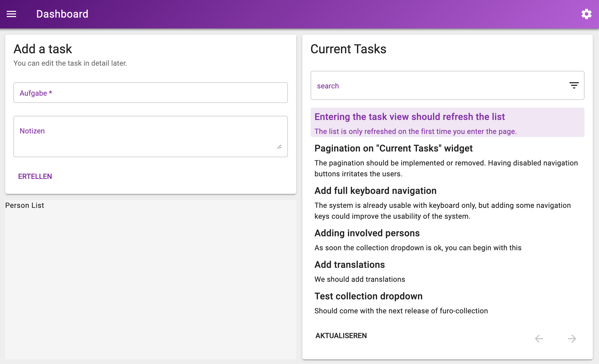

# todo-client
This is the client project of the [todo-server](https://github.com/theNorstroem/todo-server).
 
This application is for educational (showing the concepts) purposes only.

## Usage
Install the dependencies with `npm run install`.
 
To start the development server just run `npm run start`. DO NOT FORGET TO START THE SERVER TOO. 

> This will start a dev. server on http://localhost:8080 with a proxy
for `/api` which connects to :7001 (see the [illustration](#overview) below).

Look at the package json to see what other scripts are installed. For more details visit [open-wc.org](https://open-wc.org). 
We make heavy use of the standards defined there. It is also a good idea to read something about [lit](https://lit-element.polymer-project.org/), because the [furo components](https://components.furo.pro/) from the [furo project](https://furo.pro/) uses lit element as a base for most of the components.  


### What you should see when you start the client with the [todo-server](https://github.com/theNorstroem/todo-server)
After starting the [server](https://github.com/theNorstroem/todo-server) and starting the client with `npm run start` you should see the development version of the client on http://localhost:8080.
 
Login with user *demo*  and password *1234*

  


---


### Overview

```

    :8080
   +-------------------------+
   |                         |
   |       todo-client       |  <-----------------+
   |     (es dev server)     |                    |
   +-------------------------+                    |
                | /api proxies t          +----------------+
    :7001       v                         |   todo-specs   |
   +-------------------------+            +----------------+
   |                         |                    |
   |       grpc gateway      |  <-----------------+
   |                         |                    |
   +-------------------------+                    |
                |                                 |
    :7000       v                                 |
   +-------------------------+                    |
   |                         |                    |
   |       todo-server       |  <-----------------+
   |                         |
   +-------------------------+

```
